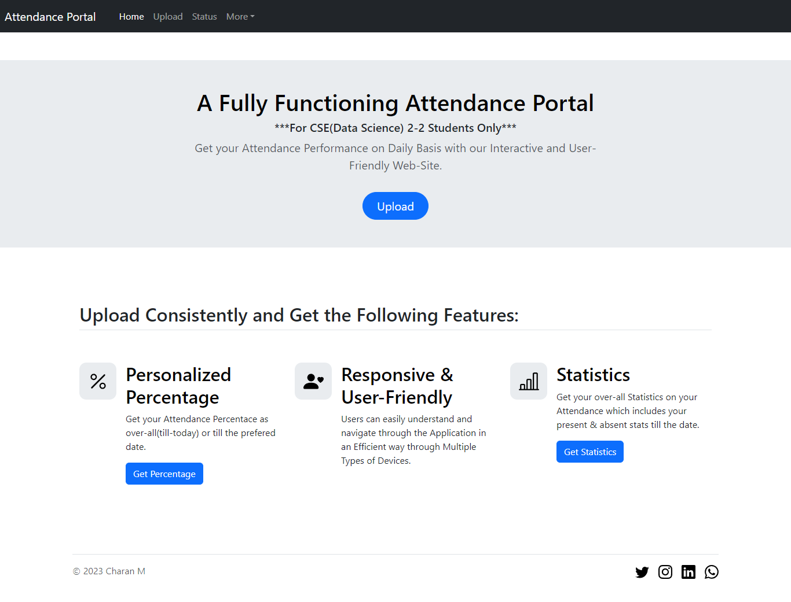
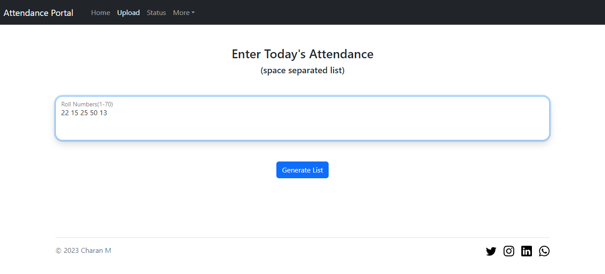
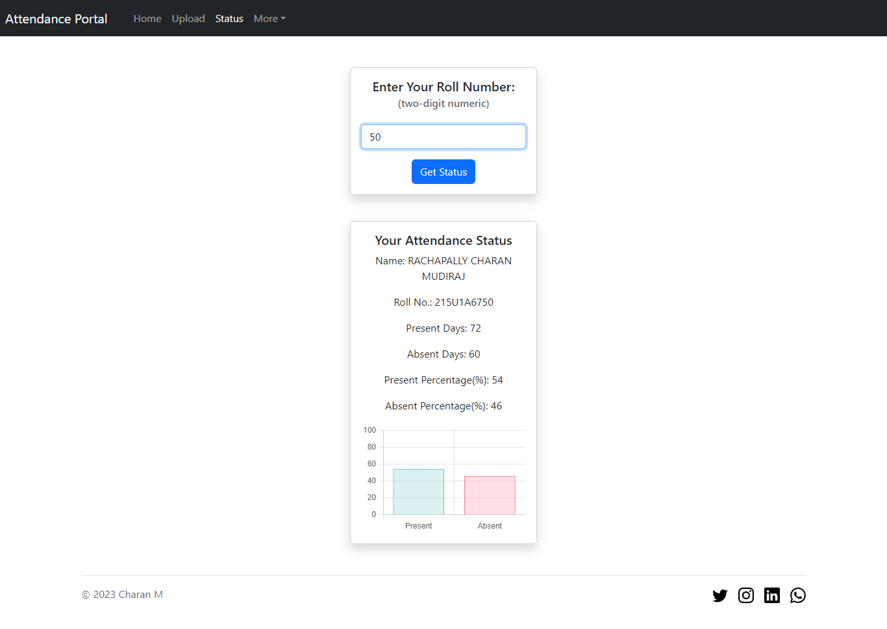
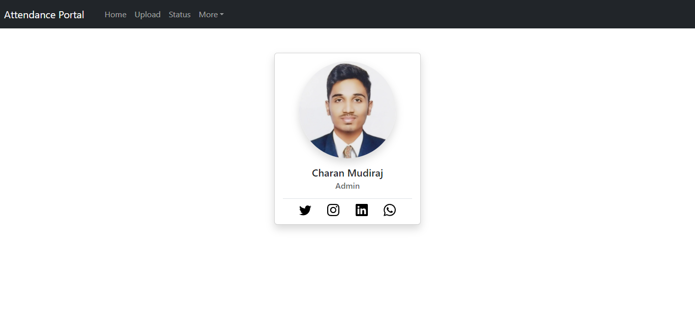

**Attendance Portal** is a responsive fullstack demo application were:

1. Students can monitor their current attendance performance with userfriendly UI and strong input validation.
2. Admins can post the attendance every day and the same may get updated into each user stats.

## Stack used:

- HTML
- Bootstrap
- EJS
- Express
- ChartJS

## Views

1. Home Page
   
2. Upload Page (for admins)
   
3. Status Page (for users/students)
   
4. About Page
   
